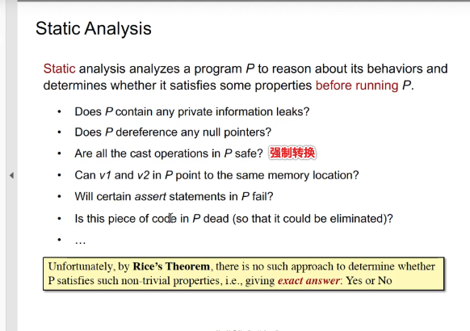
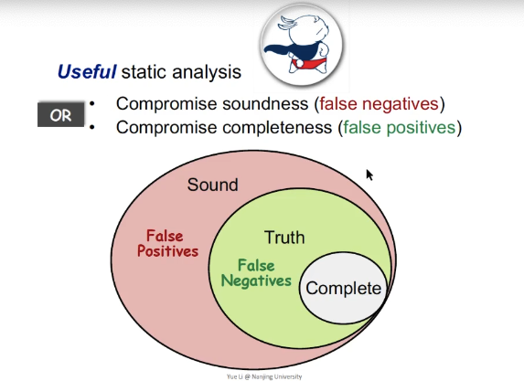
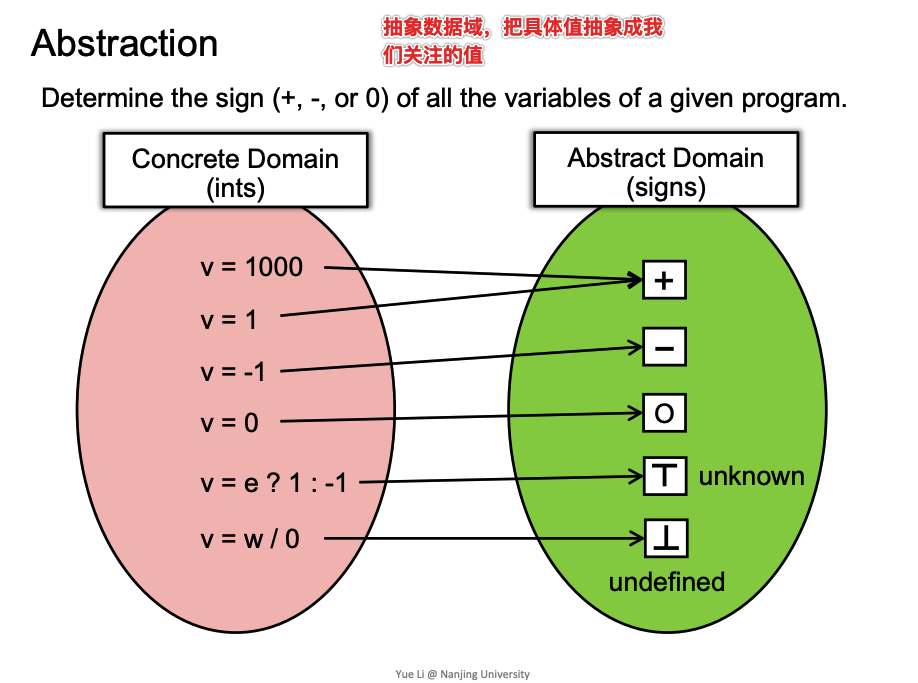
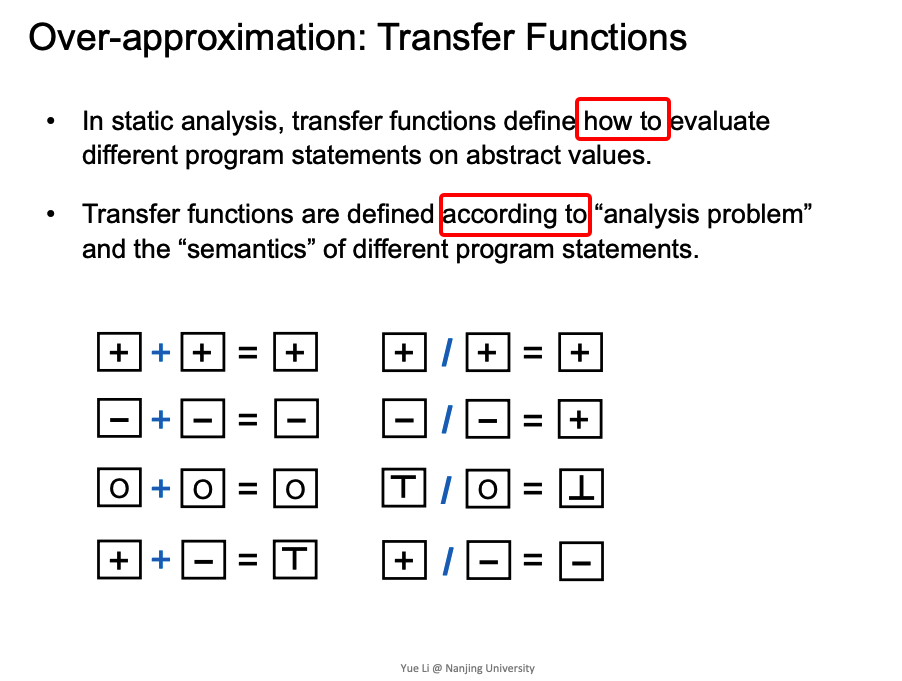
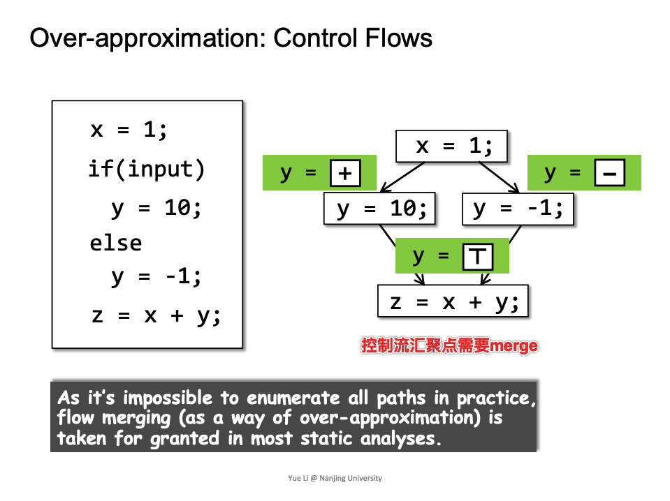
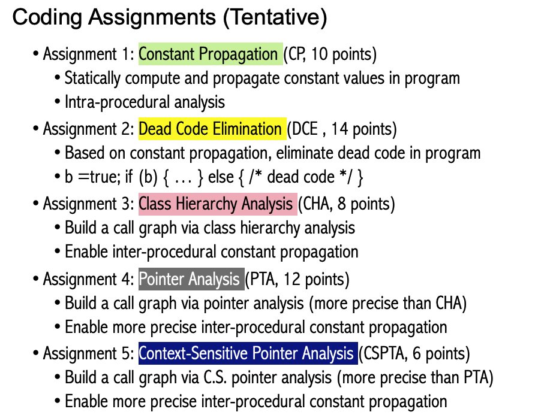

# Course Introduction

## PL and Static Analysis

图.1-1.程序分析在PL中的位置

## Why We Lean Static Analysis

## What is Static Analysis

图.1-2.静态分析定义

Rice's theorem表示，静态分析对于一些有意义的分析，不能得出 exact answer

## Static Analysis Features and Examples

### soundness

图.1-3.Sound、Complete关系

 
Rice's Theorem对于non-trivial properties不存在精确答案。所以就有了sound、complete两个概念。
 

因为不存在exact answer，所以有两个选择：
-  妥协soundness，存在漏报
-  妥协compeleness，存在误报

静态分析一般的应用是compromise completeness的,及是sound的，可以有误报，但不能漏报。比如做一些bug的检测，宁可信其有，不可信其无，限定可能范围，排查错误。

### 如何实现

在技术上实现 : Abstraction + Over-approximation

- Abstraction   抽象数据域
- Over-approximation   
  - Transfer functions 抽象数据在语句的转换
  - Control flows 抽象数据在控制流上的转换  

### 一个栗子

### 精度与速度平衡

Static analysis:ensure(or get close to)soundness, while making good trade-offs between analysis precision and analysis speed.

## Teaching Plan

## Evalution Criteria

